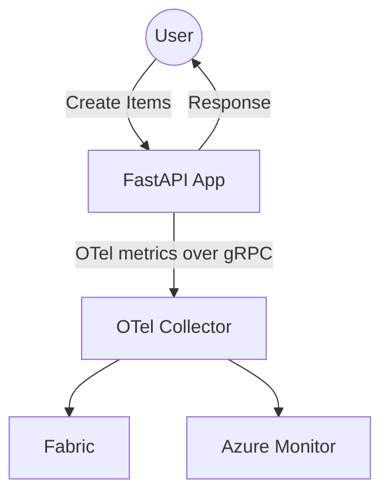

# otel-to-fabric

## Data Flow



## Azure Monitor Setup

- Create an [Application Insights resource](https://learn.microsoft.com/en-us/azure/azure-monitor/app/create-workspace-resource?tabs=portal#create-an-application-insights-resource)
- Find the Application Insights [Connection String](https://learn.microsoft.com/en-us/azure/azure-monitor/app/connection-strings?tabs=net#find-your-connection-string)
- Create a `.env` file with the Application Insights Connection String. `sample.env` is provided as example.

## Run the E2E Solution
```sh
docker compose up
```