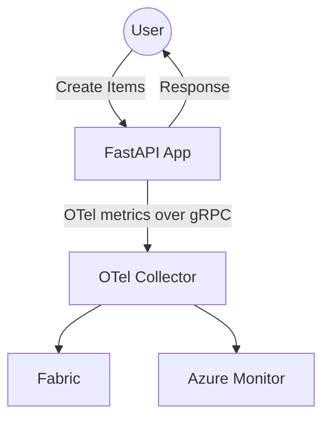

# otel-to-fabric

## Data Flow



## Azure Monitor Setup

- Create an [Application Insights resource](https://learn.microsoft.com/en-us/azure/azure-monitor/app/create-workspace-resource?tabs=portal#create-an-application-insights-resource)
- Find the Application Insights [Connection String](https://learn.microsoft.com/en-us/azure/azure-monitor/app/connection-strings?tabs=net#find-your-connection-string)
- Create a `.env` file with the Application Insights Connection String. `sample.env` is provided as example.
- This solution leverages the OpenTelemetry [Azure Monitor Exporter](https://github.com/open-telemetry/opentelemetry-collector-contrib/blob/main/exporter/azuremonitorexporter/README.md) to send telemetry to Azure Monitor. Check out the docs for further config options.

## Run the E2E Solution
Open the solution in VS Code [Dev Containers](https://code.visualstudio.com/docs/devcontainers/containers) or [GitHub Codespaces](https://github.com/codespaces).
```sh
docker compose up
```