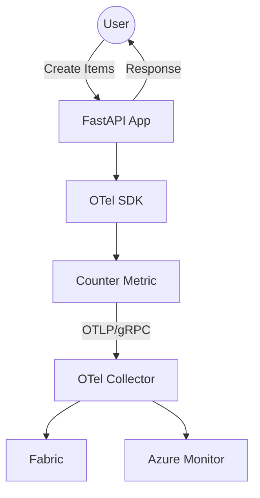

# otel-to-fabric

```mermaid
flowchart TD
    User((User)) -->|"Create Items"| FastAPI[FastAPI App]
    FastAPI -->|"Response"| User
    FastAPI --> OTelSDK[OTel SDK]
    OTelSDK --> Metrics["Counter Metric"]
    Metrics -->|"OTLP/gRPC"| Collector[OTel Collector]
    Collector --> Fabric
    Collector --> AzMon[Azure Monitor]
```